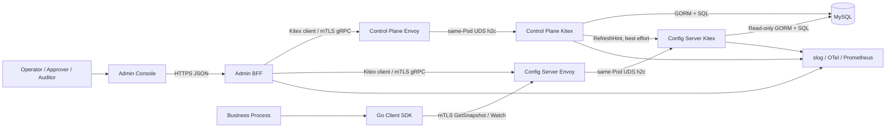
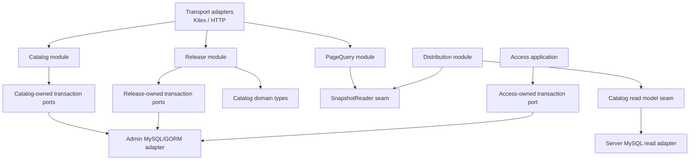

# FinConfig V1 整体设计

## 1. 目标

FinConfig V1 是一个 MySQL 驱动、读写分离、发布受控的结构化配置平台，提供四类可运行产物：

1. Control Plane：管理元数据、配置模型和 ReleaseOrder。
2. Config Server：构建不可变快照，提供读取、QueryPage、版本比较和 Watch。
3. Go Client SDK：在业务进程内维护 last-known-good 快照和索引查询。
4. Admin Console：通过 Admin BFF 完成查询、变更审查、发布推进、诊断和审计。

V1 优先保证一致性语义、故障后保留 last-known-good、可审计和可测试，不追求任意数据库查询或复杂工作流编排。

## 2. 系统上下文



MySQL 是权威事实来源。RefreshHint 和 Watch 都是收敛加速信号，不是权威配置；信号丢失后由 version poll 恢复。

Envoy 是 Kitex server 的 TLS/mTLS 终止边界；Kitex 后端只通过同 Pod UDS（或开发环境 loopback）接受标准 gRPC h2c，不暴露明文网络端口。该边界由 ADR 0005 固定。

## 3. 部署单元与职责

| 部署单元 | 写数据库 | 主要职责 | 不承担 |
|---|---:|---|---|
| `control-plane` | 是 | 元数据、模型、模板、发布单、审批、步骤执行、审计、outbox relay | 配置读取热路径、浏览器页面拼装 |
| `config-server` | 否 | 快照构建、增量刷新、GetSnapshot、DiffVersions、Watch、QueryPage | 配置写入、发布状态机 |
| `admin-bff` | 否 | 浏览器认证、HTTP DTO、聚合 Control Plane/Config Server、CSRF 与限流 | 领域校验、发布决策、快照计算 |
| `admin-console` | 否 | 模型驱动查询、ChangeDraft、Diff、发布操作与诊断 UI | 权限真相、数据持久化、领域状态机 |
| Go SDK | 否 | 拉取、Watch、自愈、不可变本地快照、索引查询、回调隔离 | 配置写入、发布 |

Outbox relay 在 V1 作为 `control-plane` 内的独立 run group 启动，接口和生命周期独立，以便未来拆进程但不提前增加部署单元。

## 4. 仓库形态

V1 使用 multi-module monorepo。Frontend、Admin、Server、Client SDK 是四个独立产品 package；Admin、Server、Client SDK 各自拥有 `go.mod`，根目录只用 `go.work` 做本地编排。完整依赖和发布规则见 `00a-multi-module-monorepo.md` 与 ADR 0008。

```text
contracts/                           # 独立 Go module；proto/OpenAPI/generated/schema manifest
platform/                            # 独立 Go module；无业务语义的技术模块
admin/                               # 独立 Go module；Control Plane、BFF、migration
server/                              # 独立 Go module；Snapshot、QueryPage、Watch
client_sdk/                          # 独立、可外部 import 的 Go module
frontend/                            # 独立 pnpm package
deploy/
examples/
docs/design/
docs/adr/
```

产品 module 不得互相 import。领域包不得 import Kitex、protobuf、GORM、MySQL driver、HTTP framework 或具体日志实现。生成 DTO 只允许出现在各产品 Interfaces adapter。

## 5. 模块图与依赖方向



依赖只向领域和模块接口流动。每个 application package 声明它实际需要的 transaction port；禁止建立覆盖全系统的 god `UnitOfWork`/`Tx`。同一产品内的 MySQL adapter 可以实现多个 application-owned port。MySQL、Kitex、HTTP 是 adapter，不向内层泄漏。Admin→Server 与 SDK→Server 只允许通过 RPC contract 建立运行时关系。

## 6. 核心写入路径

配置数据没有直接 CRUD：

```text
QueryPage/Edit UI
  -> browser ChangeDraft
  -> diff + expected record revision
  -> CreateReleaseOrder(idempotency key)
  -> approve/execute/advance
  -> one MySQL transaction:
       record or overlay mutation
       + ConfigRevision（仅可见配置效果）
       + collection version/digests
       + change log
       + release aggregate
       + audit record
       + outbox event
  -> commit
  -> best-effort RefreshHint
  -> config-server refresh
  -> SDK pull and atomic swap
```

事务提交前不调用网络。事务外失败只影响收敛速度，不反转已提交事实。

## 7. 核心读取路径

Config Server 持有一个原子 `*ConfigurationSnapshot`。刷新构建新对象，完整校验后一次替换；任何失败都不原地修改旧对象。

- Go SDK 通过 GetSnapshot 拉取，再在本地构建紧凑不可变快照。
- QueryPage 在请求开始只读取一次 snapshot 指针，并用该指针完成模型、数据、Overlay 和选项解析。
- Watch 只提示“应至少达到哪个 revision”；SDK 必须重新拉取或比较版本。

## 8. 一致性等级

| 场景 | 保证 |
|---|---|
| 单次发布步骤写入 | MySQL 本地强一致、全有或全无 |
| ReleaseOrder 与记录/Overlay/Version/ChangeLog/Outbox | 同事务原子 |
| Config Server 请求内 | 单不可变 snapshot 指针一致 |
| QueryPage ALL 的数据与选项 | 同一 snapshot identity；跨 Collection 选项依赖组 all-or-nothing 刷新 |
| SDK 单次查询 | 单个本地 snapshot 一致 |
| 数据库到 Config Server/SDK | 最终一致，可通过 revision 验证 |
| 多次分页跨 generation | 不保证连续快照；前端检测 generation 后重置 |
| RefreshHint/Watch | 至少一次或丢失均安全，重复和乱序幂等 |

## 9. 全局不变量

1. 已发布 snapshot 及全部嵌套对象不可变。
2. ConfigRevision 只在产生分发可见变化的写事务内分配；EntityRevision 与 LeaseRevision 分别服务聚合并发和 Outbox CAS，三者不得混用。
3. RecordKey 和复合索引 key 使用规范无碰撞编码，禁止分隔符拼接。
4. ADD/MODIFY 保存完整合法记录；DELETE 仅携带 RecordKey。
5. ONE_TO_ONE 索引冲突使整个集合刷新失败并保留旧集合。
6. ReleaseTemplate 创建后不可变；ReleaseOrder 保存模板快照。
7. BASE_FINAL 在途冲突键为 `(collection, environment, record_key)`；OVERLAY_FINAL 为 `(collection, full scope, record_key)`。
8. 成功发布单不可原地回滚，只能创建补偿发布。
9. 任意配置效果变化都必须产生 revision、change log、audit 和 outbox。
10. Principal 只能来自认证 adapter，领域模块不信任请求体自报身份。
11. Sensitive 值不得写入日志、metric label、trace attribute 或未授权响应。
12. GORM model、protobuf DTO 和 React DTO 都不是领域模型。
13. 基础 ConfigurationRecord 以 Environment 隔离；任何 BASE_APPLY 只影响目标 Environment。
14. SnapshotGeneration 只在同一 ServerInstanceID 内单调，不得跨实例比较；ServerEpoch 变化强制客户端 FULL。

## 10. V1 范围外

- PostgreSQL 和跨数据库方言抽象。
- first-class tenant；Scope 固定为 Region/Environment/Stage。
- SQL 文本查询、运行时 schema 探测、任意 JOIN。
- 多主写和跨地域数据库复制方案。
- 外部审批厂商适配器、NATS/Kafka 等消息系统。
- 非 Go 客户端 SDK。
- 可持久化共享 ChangeDraft；V1 草稿只在浏览器存在。

## 11. 决策优先级

编码时按以下优先级解决冲突：

1. 已冻结 proto/OpenAPI 契约和本目录中的显式不变量。
2. 目标模块详细设计。
3. 整体设计。
4. 原始 clean-room 提示词。
5. README 中的产品愿景。

任何必须改变 1 或 2 的实现发现，都应先更新设计和契约测试，而不是在实现中静默绕过。
