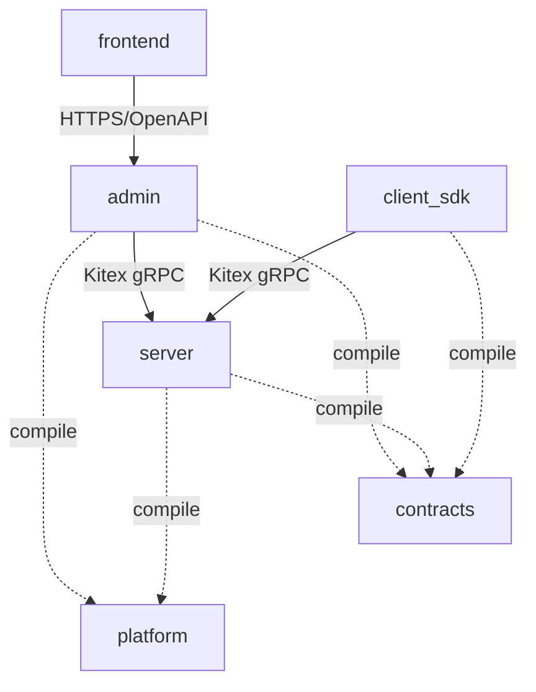

# Multi-module monorepo 与代码归属设计

## 1. 目标

仓库用独立 module 表达产品所有权，而不是只靠目录约定。四个产品交付物是 Frontend、Admin、Server 和 Client SDK；三个 Go 产品分别在自己的 module 内按 DDD bounded context 拆分。

本设计固定三个层次：

1. 产品 module：独立构建、测试、发布，不互相 import。
2. bounded context：拥有自己的领域语言、用例和持久化/transport adapter。
3. layer：`domain`、`application`、`infrastructure`、`interfaces`，依赖只向内。

## 2. 目标仓库结构

```text
financial_configuration_center/
├── go.work
├── package.json                  # 仅 workspace/build orchestration
├── pnpm-workspace.yaml
│
├── contracts/                   # Go module: .../contracts
│   ├── go.mod
│   ├── proto/
│   ├── openapi/
│   ├── gen/go/
│   ├── kitex_gen/                # Kitex 固定生成根，仍属于 Contracts module
│   └── schema/mysql/             # schema version/table compatibility manifest
│
├── platform/                    # Go module: .../platform
│   ├── go.mod
│   ├── auth/
│   ├── health/
│   ├── lifecycle/
│   ├── mysql/
│   ├── observability/
│   └── rpc/
│
├── admin/                       # Go module: .../admin
│   ├── go.mod
│   ├── cmd/
│   │   ├── control-plane/
│   │   ├── admin-bff/
│   │   ├── migrate/
│   │   └── seed/
│   ├── db/migrations/mysql/
│   └── internal/
│       ├── catalog/
│       │   ├── domain/
│       │   ├── application/
│       │   ├── infrastructure/mysql/
│       │   └── interfaces/rpc/
│       ├── release/
│       │   ├── domain/
│       │   ├── application/
│       │   ├── infrastructure/mysql/
│       │   └── interfaces/rpc/
│       ├── access/
│       │   ├── domain/
│       │   ├── application/
│       │   ├── infrastructure/
│       │   │   ├── mysql/
│       │   │   └── rpc/
│       │   └── interfaces/rpc/
│       ├── audit/
│       │   ├── domain/
│       │   ├── application/
│       │   ├── infrastructure/mysql/
│       │   └── interfaces/rpc/
│       ├── outbox/
│       │   ├── domain/
│       │   ├── application/
│       │   └── infrastructure/
│       │       ├── mysql/
│       │       └── rpc/
│       ├── migration/
│       │   ├── application/
│       │   └── infrastructure/goose/
│       ├── seed/
│       │   └── application/
│       ├── bff/
│       │   ├── application/
│       │   ├── infrastructure/
│       │   │   ├── identity/
│       │   │   ├── rpc/
│       │   │   └── session/
│       │   └── interfaces/http/
│       └── runtime/
│           ├── controlplane/
│           ├── bff/
│           ├── migrate/
│           └── seed/
│
├── server/                      # Go module: .../server
│   ├── go.mod
│   ├── cmd/config-server/
│   └── internal/
│       ├── snapshot/
│       │   ├── domain/
│       │   ├── application/
│       │   ├── infrastructure/mysql/
│       │   └── interfaces/rpc/
│       ├── query/
│       │   ├── domain/
│       │   ├── application/
│       │   └── interfaces/rpc/
│       ├── watch/
│       │   ├── domain/
│       │   ├── application/
│       │   └── interfaces/rpc/
│       ├── diagnostics/
│       │   ├── application/
│       │   └── interfaces/rpc/
│       └── runtime/
│
├── client_sdk/                  # Go module: .../client_sdk
│   ├── go.mod
│   ├── finconfig.go             # package finconfig public facade
│   ├── options.go
│   ├── errors.go
│   ├── internal/
│   │   ├── snapshot/
│   │   │   ├── domain/
│   │   │   └── application/
│   │   ├── synchronization/
│   │   │   ├── domain/
│   │   │   ├── application/
│   │   │   └── infrastructure/rpc/
│   │   ├── query/
│   │   │   ├── domain/
│   │   │   └── application/
│   │   └── runtime/
│   └── examples/                # 只 import 根 package finconfig
│
├── tools/                       # Go module: pinned code generators only
│   ├── go.mod
│   └── tools.go
├── integration/e2e/             # 非发布 Go module；跨产品黑盒验收
│   ├── go.mod
│   └── ...
│
├── frontend/                    # pnpm package: @finconfig/admin-console
│   ├── package.json
│   ├── src/
│   └── tests/
├── deploy/
├── examples/http/               # 非 Go 的跨产品调用示例
└── docs/
```

目录只表达稳定所有权。bounded context 内没有行为时不预建空目录；编码 Agent 在第一个真实用例进入时创建相应 layer。

## 3. Module 接口与依赖

| Module/package | 稳定外部接口 | 可依赖 | 禁止依赖 |
|---|---|---|---|
| `contracts` | protobuf、OpenAPI、生成 transport DTO、schema manifest | 标准库和生成工具运行库 | 任一产品、Platform、领域实现 |
| `platform` | 纯技术模块接口 | 标准库、第三方基础库 | Contracts、Admin、Server、Client SDK、产品领域策略 |
| `admin` | Control Plane RPC、Admin BFF HTTP、运维命令 | Contracts、Platform | Server、Client SDK、Frontend 实现 |
| `server` | Config/PageQuery/Watch/Diagnostics RPC | Contracts、Platform | Admin、Client SDK、Frontend 实现 |
| `client_sdk` | 根 package `finconfig` | Contracts、SDK 自有依赖 | Server、Admin、Platform、任何产品 `internal` |
| `frontend` | 浏览器 UI、OpenAPI client | OpenAPI 产物和 npm 依赖 | Server RPC、Go 实现包、数据库 |
| `tools` | 固定代码生成工具版本 | 生成工具依赖 | 任一产品实现 |
| `integration/e2e` | 黑盒 compose 验收 | Contracts 和网络测试库 | 任一产品 `internal` |

固定依赖图：



图中的 Admin→Server 和 SDK→Server 是运行时 RPC，不是 Go import。仓库检查必须拒绝以下 import prefix：

- Admin import `.../server` 或 `.../client_sdk`；
- Server import `.../admin` 或 `.../client_sdk`；
- Client SDK import `.../admin`、`.../server` 或 `.../platform`；
- Contracts/Platform import 任一产品 module。

## 4. 产品 module 内 DDD 规则

每个 bounded context 使用相同依赖方向：

```text
interfaces ──────→ application ──────→ domain
                         ↑                 ↑
infrastructure ──────────┘─────────────────┘

runtime → interfaces + application + infrastructure
```

### Domain

拥有聚合、实体、值对象、领域服务、领域错误和不变量。禁止 import protobuf、Kitex、GORM、MySQL driver、HTTP framework、具体 logger 和另一个产品 module。

### Application

拥有用例、command/query、事务端口、授权端口和用例结果。端口由需要能力的 application 声明，禁止全系统 god repository 或 god UnitOfWork。

### Infrastructure

实现 application-owned port，包括 GORM repository、MySQL read model、Kitex client 和外部身份 adapter。GORM model 只能留在该层。

### Interfaces

接收 Kitex/HTTP 请求，完成 DTO 映射、认证身份提取和状态码映射，然后调用 application。不得重写领域校验和状态机。

### Runtime

是唯一 composition root，负责配置、身份、数据库、adapter、server、worker、readiness 和 shutdown 的有序装配。runtime 不提供可被其他产品 import 的业务接口。

每个 executable 的 `cmd/<name>/main.go` 只解析进程参数、调用对应 `internal/runtime/<name>` 并映射退出码；它不是第二个 composition root。Client SDK 的根 `finconfig.New` 是公开工厂，但实际依赖装配委托给 `client_sdk/internal/runtime`。

同一产品 module 内的 bounded context 也不能绕过这些层次：一个 context 需要另一个 context 的能力时，由调用方 Application 声明窄 port，并由目标 Application 或 Infrastructure adapter 实现；禁止 import 兄弟 context 的 Interfaces/Infrastructure。确需共享的领域值类型必须有唯一明确 owner，其他 context 通过 owner 的 Domain 接口使用，不能复制成全局 `common` package。

## 5. 跨产品共享语义

跨产品不共享领域对象。相同业务概念在不同产品中可以有不同模型：

- Admin 拥有 Overlay 写模型；Server 拥有 Overlay snapshot 读取投影；Client SDK 拥有压缩后的本地有效配置模型。
- Admin 拥有 Subscription 聚合；Server 持有同 generation 的授权投影；Client SDK 只观察被授权的集合和索引。
- Admin 的 ReleaseOrder 不进入 Server 或 SDK module。

跨产品只共享：

1. wire contract；
2. MySQL schema compatibility manifest；
3. 无业务语义的技术机制。

若某个类型同时需要产品规则与 wire 稳定性，应在各产品显式映射，不能把领域类型上移到 Contracts。

## 6. Go workspace 与版本

根 `go.work` 只服务本仓库开发：

```go
go 1.26.6

use (
    ./contracts
    ./platform
    ./admin
    ./server
    ./client_sdk
    ./tools
    ./integration/e2e
)
```

固定规则：

- 根目录不保留 `go.mod`。
- 每个 module 提交自己的 `go.mod`、`go.sum`。
- 产品 `go.mod` 禁止使用相对路径 `replace`；本地替换只由 `go.work` 完成。
- `tools` 是代码生成工具固定版本 module，不进入产品运行依赖；`integration/e2e` 是非发布黑盒测试 module，不得 import 产品 `internal`。
- 发布前在 `GOWORK=off` 下验证目标 module 能仅靠已声明版本构建。
- module tag 使用路径前缀：`contracts/vX.Y.Z`、`platform/vX.Y.Z`、`admin/vX.Y.Z`、`server/vX.Y.Z`、`client_sdk/vX.Y.Z`。
- Frontend 使用自己的 `package.json` 和 package version；根 `pnpm-lock.yaml` 固定整个 Node workspace 的解析结果，根 package 只做脚本编排，不承载前端运行代码。

支撑 module 与产品的发布只能按以下 expand/contract 顺序进行：

1. Contracts/Platform 先提交兼容扩展，通过自己的 `GOWORK=off` 门禁并 push；
2. 创建路径前缀 tag，确认公共 module proxy 或直接 VCS 能解析该版本；
3. 产品在后续 commit 中把 `go.mod` 更新为该精确 tag，并从第一个 dependent 批次开始运行 `GOWORK=off go test ./...`；
4. 所有消费者迁移并发布后，破坏性删除只能进入支撑 module 的下一主版本。

禁止在同一未发布 workspace commit 中同时引入新的支撑 module 接口和依赖它的产品版本，再用 `go.work` 掩盖缺失版本。初始拆分同样先为 Contracts、Platform 建立可解析的 `v0.x` tag，再开始产品 module 提取。

## 7. Contract 与生成代码所有权

- proto/OpenAPI 源文件和生成配置属于 Contracts。
- 标准 grpc-go DTO/binding 进入 `contracts/gen/go`；Kitex client/server binding 进入工具要求的 `contracts/kitex_gen`。两类生成代码都只依赖 Contracts module，不属于产品实现。
- Admin/Server handler 在各自 Interfaces layer 映射生成 DTO；生成 DTO 不进入 Domain/Application。
- Frontend OpenAPI client 生成到 Frontend 自己的 `src/api/generated`，不从 Admin 源目录做相对 import。
- schema manifest 属于 Contracts；Goose SQL migration 属于 Admin。Platform 只提供 MySQL capability/session 检查原语，Admin/Server 各自在自己的 Infrastructure layer 以固定 import 的 Contracts manifest 组成不可注入的完整 startup gate。CI 必须验证 migration 集合、最新 schema version、表 manifest 三者一致。

## 8. 独立验证与发布

CI 至少包含以下独立 job：

```text
contracts: generate-check + compatibility + unit
platform:  unit + race + Linux compile
admin:     domain/application + MySQL + RPC/HTTP contract + build
server:    snapshot/query/watch + MySQL read contract + RPC + build
client_sdk: unit + race + public API compatibility + client_sdk/examples
frontend:  lint + typecheck + unit + build + Playwright
workspace: forbidden-import check + integration/e2e compose E2E
```

任何产品 job 不得依赖另一个产品 module 的源码编译成功；跨产品 E2E 只在 workspace/compose job 完成。Admin architecture test 额外禁止 BFF runtime/application 直接 import Catalog、Release、Access、Audit、Outbox 或 MySQL 实现；BFF 到 Control Plane/Config Server 只能经过它自己的 application port 与 `infrastructure/rpc` adapter。

## 9. 从当前单 module 的迁移顺序

迁移期间冻结旧全局路径的新功能开发，只允许修复阻断迁移的回归。每一步独立 commit、测试并 push：

1. 固化本设计、ADR 和 forbidden-import 规则。
2. 创建 Tools module；提取 Contracts module并保持 wire 内容不变，同时创建包含根 module、Tools、Contracts 的过渡 `go.work`。Contracts 在独立 `GOWORK=off` 门禁后 push 并创建初始可解析 tag。
3. 创建非发布 `integration/e2e` module；在仍为单产品 root module 时先解开现有跨产品源码依赖：Server 建立自有 Catalog/Overlay read projection；Client SDK 建立自有 local snapshot model；BFF、Access 与 Outbox 改为 application port/Contracts RPC；跨产品集成测试移入该黑盒 harness。用 import-graph 测试证明待拆产品之间已经没有实现 import。
4. 提取 Platform module，只移动无产品领域语义的技术模块；独立门禁后 push、创建初始 tag，根 module 更新为该精确版本。
5. 提取 Server module，以 `git mv` 迁移 Config Server、Snapshot、QueryPage、Watch 和 runtime；`go.mod` 只 require 已发布的 Contracts/Platform 精确版本，并立即通过 `GOWORK=off`。
6. 提取 Admin module，以 `git mv` 迁移 Catalog、Release、Access、Audit、Outbox、BFF、migration 和 seed；按相同规则立即通过独立门禁。
7. 提取 Client SDK module、迁移 `examples/sdk` 到 `client_sdk/examples`，移除所有产品 internal import并冻结根 `package finconfig` public facade；该 module 只 require 已发布 Contracts 版本并立即通过独立门禁。
8. 移动 Frontend package，更新 pnpm workspace、BFF asset 构建和 OpenAPI client 生成。
9. 从 `go.work` 移除过渡根 module，删除根 `go.mod`，重写 CI/Makefile/compose，执行全部独立构建和完整 E2E。

迁移使用行为保持的 seam 解耦、文件移动和 import 重写，不借机改变 RPC、数据库、一致性或安全行为。迁移中尚未拆出的代码可以暂时留在根 module，但已经拆出的产品 module 不得反向 import 根 module。每个批次必须同时通过当时的 workspace 测试与适用 module 的 `GOWORK=off` 门禁；行为变化必须在迁移完成后的独立垂直切片中交付。

## 10. 当前代码到目标 module 的迁移映射

| 当前所有权 | 目标所有权 | 迁移约束 |
|---|---|---|
| `api/`、`gen/`、`kitex_gen/`、`internal/contracts/` | `contracts/` | wire field/number/path 不变；只改变 Go import owner |
| `internal/catalog/`、`internal/release/` | `admin/internal/catalog/`、`admin/internal/release/` | 保留聚合和 application-owned transaction ports |
| `internal/access/`、`internal/audit/`、`internal/outbox/` | 对应 `admin/internal/*/` | 移除对 Server 实现 import，跨产品调用改 Contracts RPC port |
| `internal/adminbff/` | `admin/internal/bff/` | BFF 不得直连数据库或 import Control Plane context |
| `internal/configserver/`、`internal/distribution/`、`internal/pagequery/` | `server/internal/*/` | 先用 Server 自有 read projection 替代 Catalog/Overlay domain import |
| `internal/overlay/` | Admin 写模型、Server read projection、SDK local model | 不创建共享 Overlay domain module |
| `sdk/finconfig/` | `client_sdk/` | 对外只暴露根 `package finconfig`，移除 Catalog/Overlay internal import |
| `examples/sdk/` | `client_sdk/examples/` | 只验证 public facade；禁止 import 任一产品 `internal` |
| `internal/platform/config/` | 各产品 `internal/runtime` | 配置 schema 属于产品启动接口，不整体上移 Platform |
| `internal/platform/auth/`、`internal/platform/rpcauth/` | generic verifier/metadata parser 进 Platform；身份绑定与 method policy 进产品 Interfaces/Application | 不把 Consumer/relay/role 产品策略上移 Platform |
| `internal/platform/mysql/` | connection/capability 原语进 Platform；GORM store/startup manifest wrapper 进产品 Infrastructure | Platform 不 import Contracts |
| `internal/platform/health/`、`lifecycle/`、`observability/`、`rpc/` | `platform/` | 只迁无产品语义的机制；product readiness policy 留 Runtime |
| `cmd/migrate/`、`db/migrations/mysql/` | `admin/cmd/migrate/`、`admin/internal/migration/`、`admin/internal/runtime/migrate/`、`admin/db/migrations/mysql/` | Goose runner 属 Infrastructure；migration 仍由独立 job 执行，应用不 AutoMigrate |
| `internal/seed/`、`cmd/seed/` | `admin/internal/seed/application/`、`admin/internal/runtime/seed/`、`admin/cmd/seed/` | seed 只编排正式 Admin application，不直写领域表 |
| `internal/platform/mysql/migrations/` | manifest 进 `contracts/schema/mysql/`；Goose contract harness 进 `admin/internal/migration/infrastructure/goose/` | Contracts 不 import Goose；Admin 测试验证 SQL 与 manifest 一致 |
| `web/admin-console/` | `frontend/` | 保留 `@finconfig/admin-console` package identity |
